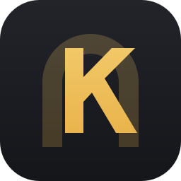

<p align="center">
  
</p>

<h1 align="center">Kavverna</h1>

<p align="center">
  One tray icon for the utilities a Linux desktop is missing.<br>
  Free, open source, and everything runs on your own machine.
</p>

<p align="center">
  <a href="https://novasvilla.github.io/kavverna/">Website</a> ·
  <a href="#install">Install</a> ·
  <a href="#everything-it-does">Features</a> ·
  <a href="docs/PRIVACY.md">Privacy</a> ·
  <a href="CHANGELOG.md">Changelog</a> ·
  <a href="https://www.linkedin.com/in/novasvilla/">Contact</a> ·
  <a href="https://github.com/sponsors/novasvilla">Buy Me a Coffee</a>
</p>

<p align="center">
  <a href="https://github.com/novasvilla/kavverna/actions/workflows/ci.yml"></a>
  <a href="https://github.com/novasvilla/kavverna/releases"></a>
  <a href="#what-you-need"></a>
  <a href="LICENSE"></a>
</p>

Per application volume, a real system monitor, clipboard history with a picker on a shortcut,
keep awake, and a pointer that refuses to go idle. The tools a Plasma desktop spreads across
half a dozen applets, or does not ship at all, behind one icon in the tray, with no account, no
telemetry and no subscription.

## Why this exists

I use [Vorssaint](https://github.com/vorssaintapp/vorssaint-utils) every day on my Mac. It puts
a per-application mixer, a system monitor, clipboard history and keep awake behind one menu bar
icon. Moving to Linux on my desktop, I could not find anything covering the same ground. Plasma
ships pieces of it, spread across separate applets, and none of them go as far.

Kavverna is the missing tool, written from scratch in Rust. It is not a port: no line of the
original was copied, and several things here work better because Linux allows what macOS does
not. See [CREDITS.md](CREDITS.md).

## Everything it does

### Sound

- **Volume per application.** One row per application rather than per stream, because a single
  application can hold several and PipeWire gives them nothing to tell apart. The row shows its
  loudest stream and a change reaches all of them.
- **Every output and input** with live volumes, mute, and switching which one is the default.
- **Mute every microphone** in one click.

### Monitoring

- **Processor** load overall and a bar per thread, with temperature read from the chip by name
  rather than by index, since those move between boots.
- **Memory** with the page cache excluded, what applications actually hold, and pressure from
  the kernel's own PSI rather than a guess.
- **Compressed swap** priced by what it really costs in RAM, not by what `free` reports.
- **Both graphics cards**, never summed: usage, temperature, power and VRAM, with the discrete
  one chosen by default.

### Clipboard

- **History** of text, images and files, with search, pinning, manual ordering and a size limit
  that pinned entries do not count toward.
- **Ctrl+Alt+V** opens it from anywhere with the search field ready. Arrows walk the list, Enter
  or Ctrl+1 to Ctrl+9 put an entry back, and the panel gets out of the way for the paste.
- **Nothing marked as a secret is ever read.** A password manager's copy carries a mime type
  that says so, and the content is never taken. Text shaped like a key is left out too.
- **Take over from Plasma.** Klipper's saved history can be adopted, keeping the times it
  already had, so replacing the built-in tool costs you nothing.
- **Empty the clipboard on its own**, on a timer, when the machine suspends or when the screen
  locks. Saved entries are left alone, and it works with the history switched off.
- **Take the tracking out of copied links**, campaign and click parameters removed the moment a
  link arrives, and everything else left byte for byte as it was.

### Energy and tools

- **Keep awake** for a set time or until switched off, with a live countdown in the panel,
  extend while running, and a choice between holding off sleep alone or the displays as well.
  It talks to the power daemon, so it is honoured rather than hoped for.
- **Move the pointer** to a random place at a random interval inside a range you choose, and
  press a key as well or instead, for the idle watchers that only count the keyboard.

## Install

Nothing is packaged yet. Building it takes Rust and Qt 6:

```sh
git clone https://github.com/novasvilla/kavverna
cd kavverna
cargo build --release
./target/release/kavverna-shell
```

A PKGBUILD is in [packaging/](packaging/) for anyone who wants an Arch package today. An AUR
package will follow once the feature set is worth installing.

## What you need

- KDE Plasma 6 on Wayland. Tested on CachyOS with Plasma 6.7 and Qt 6.11.
- PipeWire for the mixer.
- `ydotool` only if you later want synthetic paste. Nothing today requires it.

Other distributions are not supported yet, which means untested rather than refused. Everything
KDE specific is reached over D-Bus and QML imports rather than linked, so widening support is a
matter of adding backends rather than rewriting.

## Private by default

Nothing leaves the machine. There is no account, no telemetry, no update check and no network
code of any kind. What you copy is stored under `$XDG_DATA_HOME/kavverna` in a database only
your user can read, and the settings live beside it with the same permissions. All of it can be
deleted at any time from the panel or by removing the directory.
See [docs/PRIVACY.md](docs/PRIVACY.md).

## What Wayland does not allow

Being straight about this up front, because these limits are not going away:

- **Which application copied something cannot be known.** A selection carries no client
  identity and KWin exposes no foreign toplevel protocol. So there is no source column, and
  exclusions work by the mime type a password manager sets rather than by application.
- **The tray icon cannot show text.** A StatusNotifierItem carries an icon and nothing else, so
  live readings need a panel applet, which is on the way.
- **A window cannot place itself.** The panel anchors to a screen edge rather than appearing
  under the pointer.
- **Emptying the clipboard fights Plasma.** Klipper puts the content straight back unless its
  Prevent empty clipboard option is turned off.
- **Per-process power draw cannot be measured.** RAPL needs root, so anything labelled energy
  use would be an estimate, and none is shown rather than showing a guess.

## What is next

In roughly this order. Anything here is a good place to start if you want to help.

- **A panel applet**, so the readings are visible without opening anything. The tray cannot
  show text, so this is the only place live numbers can live.
- **Light and dark themes** following the desktop, and switchable by hand.
- **Application icons in the mixer**, resolved from the desktop entry of the same name.
- **Paste as plain text**, and pasting straight from the picker into the application you were
  in. Both need synthetic input, which is why they are not here yet.
- **A shelf** for files, text and links, anchored to a screen edge.
- **Text snippets**, expanded through the input method rather than by typing keystrokes, so it
  needs no privilege at all.
- **A scratchpad** for the notes that are on their way somewhere else.
- **Answering in KRunner**, so the history and the snippets are reachable from the launcher
  everyone already uses.
- **A second history for the middle-click selection**, which macOS has no concept of.
- **Fan control**, last, with its own privileged daemon and a thermal watchdog. A fan left
  stopped can damage hardware, so it waits until it can be done properly.

## Contributing

More tools are welcome, and adding one is a smaller job than it looks: a descriptor in the
feature catalogue, a crate that knows nothing about Qt, and a section in the panel.
[CONTRIBUTING.md](CONTRIBUTING.md) walks through it.

## Credit

Written by [@novasvilla](https://github.com/novasvilla),
[on LinkedIn](https://www.linkedin.com/in/novasvilla/).

Inspired by [Vorssaint](https://github.com/vorssaintapp/vorssaint-utils), which is where these
ideas come from. GPL-3.0-or-later, the same licence they chose.
