<p align="center">
  
</p>

<h1 align="center">Kavverna</h1>

<p align="center">
  One tray icon for the utilities a Linux desktop is missing.<br>
  Free, open source, and everything runs on your own machine.
</p>

<p align="center">
  <a href="https://novasvilla.github.io/kavverna/">Website</a> ·
  <a href="#install">Install</a> ·
  <a href="#everything-it-does">Features</a> ·
  <a href="docs/PRIVACY.md">Privacy</a> ·
  <a href="CHANGELOG.md">Changelog</a> ·
  <a href="https://www.linkedin.com/in/novasvilla/">Contact</a> ·
  <a href="https://github.com/sponsors/novasvilla">Buy Me a Coffee</a>
</p>

<p align="center">
  <a href="https://github.com/novasvilla/kavverna/actions/workflows/ci.yml"></a>
  <a href="https://github.com/novasvilla/kavverna/releases"></a>
  <a href="#what-you-need"></a>
  <a href="LICENSE"></a>
</p>

<p align="center">
  <a href="https://github.com/sponsors/novasvilla"></a>
</p>

<p align="center">
  <picture>
    <source media="(prefers-color-scheme: dark)" srcset="docs/assets/readme/dark-sound.png">
    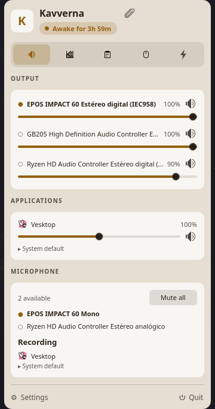
  </picture>
  <picture>
    <source media="(prefers-color-scheme: dark)" srcset="docs/assets/readme/dark-monitoring.png">
    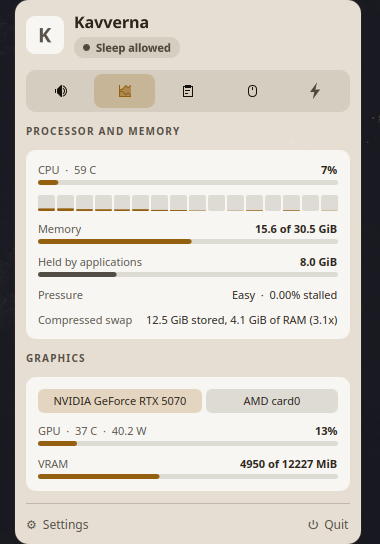
  </picture>
  <picture>
    <source media="(prefers-color-scheme: dark)" srcset="docs/assets/readme/dark-clipboard.png">
    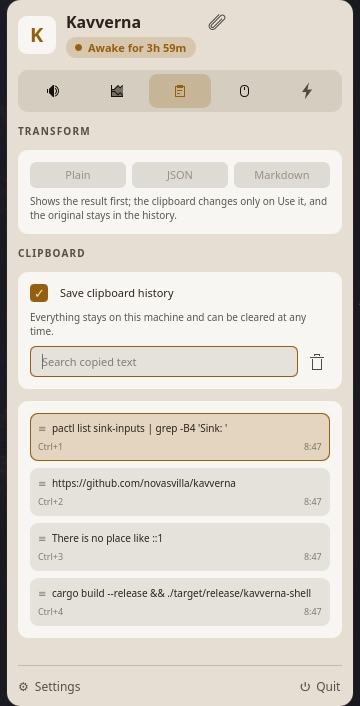
  </picture>
  <picture>
    <source media="(prefers-color-scheme: dark)" srcset="docs/assets/readme/dark-settings.png">
    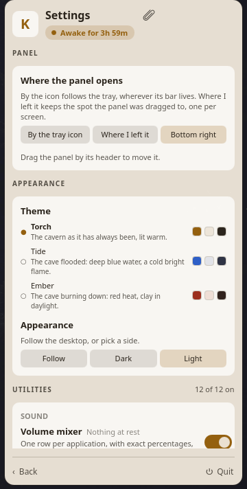
  </picture>
  <picture>
    <source media="(prefers-color-scheme: dark)" srcset="docs/assets/readme/dark-shelf.png">
    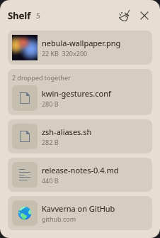
  </picture>
</p>

<p align="center">
  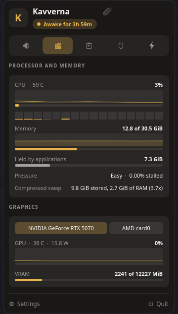
  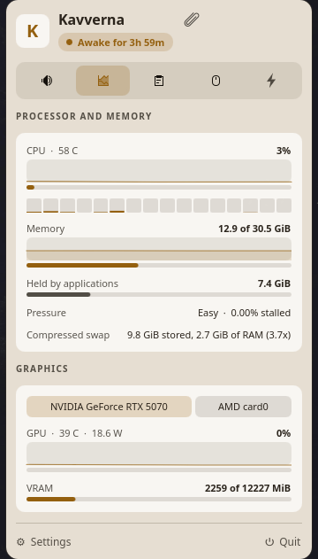
  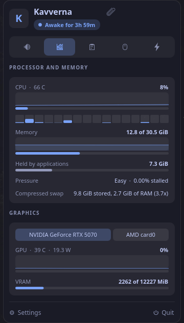
  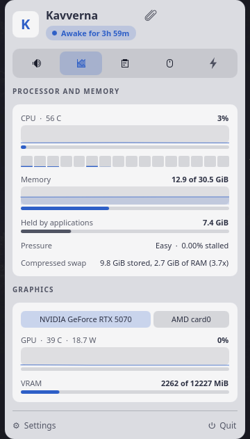
  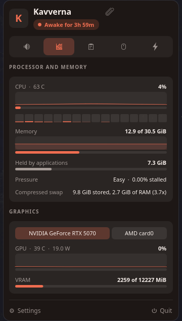
  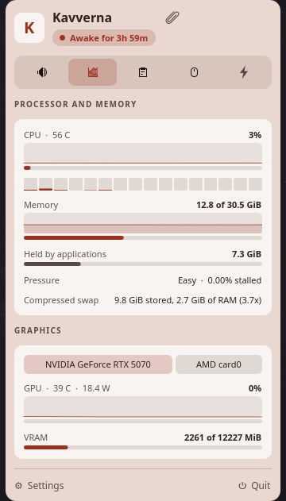
</p>

<p align="center">
  <sub>The same page in every light the cavern has: Torch, Tide and Ember, each dark and
  light, following the desktop or pinned to either.</sub>
</p>

Per application volume and routing, a real system monitor, clipboard history with a picker on
a shortcut, a shelf that holds files mid-task, keep awake, and a pointer that refuses to go
idle. The tools a Plasma desktop spreads across half a dozen applets, or does not ship at all,
behind one icon in the tray, with no account, no telemetry and no subscription.

## Why this exists

I use [Vorssaint](https://github.com/vorssaintapp/vorssaint-utils) every day on my Mac. It puts
a per-application mixer, a system monitor, clipboard history and keep awake behind one menu bar
icon. Moving to Linux on my desktop, I could not find anything covering the same ground. Plasma
ships pieces of it, spread across separate applets, and none of them go as far.

Kavverna is the missing tool, written from scratch in Rust. It is not a port: no line of the
original was copied, and several things here work better because Linux allows what macOS does
not. See [CREDITS.md](CREDITS.md).

## Everything it does

### Sound

- **Volume per application.** One row per application rather than per stream, because a single
  application can hold several and PipeWire gives them nothing to tell apart. The row shows its
  loudest stream and a change reaches all of them.
- **Named and drawn by what it is, not by what it was built with.** A stream calls itself SDL
  Application, Chromium or electron; the desktop knows it as Dota 2 or Vesktop and carries its
  icon. Three ways in: the identity Steam hands a game, the identity a program announces through
  `StartupWMClass` or its own entry file, and the binary it runs. Every Steam game and every
  Electron application is covered rather than a chosen few.
- **Every output and input** with live volumes, mute, and switching which one is the default.
  Device volume is written where it actually lives, on the card's route, so the slider moves
  what you hear.
- **Send each application to its own output.** Music to the speakers, the game to the headset:
  every application row carries where it plays, a tap opens the outputs, and the choice is
  remembered by application. Unplug the chosen device and sound falls back to the default; plug
  it back in and the application returns to it. A stream that refuses to be moved says so on
  its row instead of hiding.
- **The same for microphones.** Applications recording are listed with the source each one
  reads from, and each can be pointed at its own.
- **Mute every microphone** in one click, or from a shortcut.
- **Come back to a preferred microphone**: pin one and it is made the default again whenever it
  is plugged back in.
- **Step through the outputs you choose** from a shortcut or the tray, not through every
  output there is.

### Monitoring

- **Processor** load overall and a bar per thread, with temperature read from the chip by name
  rather than by index, since those move between boots.
- **The last two minutes behind each reading**, drawn as a trace, so the spike that was over
  before the panel opened is still there to see.
- **Memory** with the page cache excluded, what applications actually hold, and pressure from
  the kernel's own PSI rather than a guess.
- **Compressed swap** priced by what it really costs in RAM, not by what `free` reports.
- **Both graphics cards**, never summed: usage, temperature, power and VRAM, with the discrete
  one chosen by default.

### Clipboard

- **History** of text, images and files, with search, pinning, manual ordering and a size limit
  that pinned entries do not count toward.
- **Ctrl+Alt+V** opens it from anywhere with the search field ready. Arrows walk the list, Enter
  or Ctrl+1 to Ctrl+9 put an entry back, and the panel gets out of the way for the paste.
- **Nothing marked as a secret is ever read.** A password manager's copy carries a mime type
  that says so, and the content is never taken. Text shaped like a key is left out too.
- **Take over from Plasma.** Klipper's saved history can be adopted, keeping the times it
  already had, so replacing the built-in tool costs you nothing.
- **Empty the clipboard on its own**, on a timer, when the machine suspends or when the screen
  locks. Saved entries are left alone, and it works with the history switched off.
- **Take the tracking out of copied links**, campaign and click parameters removed the moment a
  link arrives, and everything else left byte for byte as it was.
- **Turn what was copied into something else**: plain text, laid out JSON, or Markdown made
  from the copy's own HTML, read at the moment you ask rather than stored. The result is shown
  first with a sentence measuring it, the clipboard changes only when you take it, and the
  original stays in the history.

### The shelf

- **A place to put things down mid-task.** Drop files, folders, text or links onto it and they
  wait until dragged somewhere else: a file manager, an upload field, a chat. Several things
  dropped together stay together as one pile.
- **Dropping stages, never copies.** A local file is held by its path; only content with no
  file behind it, an image dragged out of Firefox or a snippet of text, is written into the
  shelf's own directory. A web address stays a link and is never fetched.
- **Reachable mid-drag.** A thin strip on the right screen edge opens the shelf the moment a
  drag touches it, and Ctrl+Alt+S works even with a file in hand. A drag elsewhere on the
  desktop is invisible to every Wayland client, so the strip is the honest version of a shelf
  that appears when dragging starts.
- **Per item**: open, reveal in the file manager, copy the path, take it off. Items whose file
  has meanwhile vanished dim and say so instead of offering a dead drag.
- **It lives where you put it.** Drag the shelf by its header, with the same live outline the
  panel shows, and it reopens there; pick which edge the strip and the shelf hang from until
  then.
- **It survives restarts** behind a setting, and an item dragged to a destination that accepted
  it leaves the shelf on its own, the way a hand-off should.

### The suite itself

- **Every utility has its own switch**, grouped as the panel groups them. One switched off
  disappears from the panel and from the settings, and stops running: its thread never starts.
  Turning it back on restores what it was configured to do, since removing one never writes to
  its own settings.
- **Three themes, each designed whole.** Torch is the cavern Kavverna has always been; Tide
  floods it in blue-slate; Ember burns it down in red. Every one has a light and a dark
  variant, every text and surface pair was measured against WCAG AA before its values froze,
  and the palette applies the moment it is picked. Following the desktop or pinning light and
  dark works the same in all three.
- **The panel opens where it is useful.** Beside the tray icon by default, wherever your bar
  lives; or wherever you last dragged it, one spot per screen; or the old corner. Drag it by
  its header, and an outline the exact size of the panel shows where it will land.
- **A tray menu that reaches the whole suite**, not just keep awake: mute every microphone, move
  to the next output, open the history.
- **A shortcut for every utility worth reaching blind**: the panel, the clipboard, the shelf,
  keep awake, mute every microphone, the next output. Registered through the desktop, so System
  Settings lists them beside every other shortcut and rebinding is done there.
- **Each utility says what it costs**: nothing at rest, reads on a timer, watches the
  clipboard. The label sits beside the switch, so the choice is made against a fact.
- **`--selftest`** reports what the machine offers of everything Kavverna relies on, one line
  each, so a report from an untested distribution arrives as data.

### Energy and tools

- **Keep awake** for a set time or until switched off, with a live countdown in the panel,
  extend while running, and a choice between holding off sleep alone or the displays as well.
  It talks to the power daemon, so it is honoured rather than hoped for.
- **Move the pointer** to a random place at a random interval inside a range you choose, and
  press a key as well or instead, for the idle watchers that only count the keyboard.

## Install

### On Arch, building it yourself

The `PKGBUILD` builds from the tagged release and installs the binary, the desktop entry and
the icon the way anything else on the system does:

```sh
git clone https://github.com/novasvilla/kavverna
cd kavverna/packaging
makepkg -si
```

`pacman -R kavverna` removes it again. This is the route to take on a machine you keep: it
links against the Qt 6, PipeWire and SQLite that machine actually has, so a later system
update cannot leave it pointing at a library that has moved.

### On Arch, the package attached to a release

Every [release](https://github.com/novasvilla/kavverna/releases) carries a built
`kavverna-<version>-x86_64.pkg.tar.zst`. It is for Arch or CachyOS on x86_64, running Plasma 6
on Wayland, with the Qt 6 the system already has:

```sh
curl -LO https://github.com/novasvilla/kavverna/releases/latest/download/kavverna-x86_64.pkg.tar.zst
sudo pacman -U kavverna-x86_64.pkg.tar.zst
```

That URL always points at the newest release, and `pacman` takes the version from inside the
package rather than from the file name. Downloaded first rather than handed to `pacman` as a
URL, because a remote file makes pacman look for a signature beside it and the package is not
signed.

To check it against the checksum published with it, which is what stands in for a signature:

```sh
curl -LO https://github.com/novasvilla/kavverna/releases/latest/download/kavverna-x86_64.pkg.tar.zst.sha256
sha256sum -c kavverna-x86_64.pkg.tar.zst.sha256
```

`pacman` resolves the same dependencies the source build does, since both come from the same
`PKGBUILD`. The trade is that this binary was linked against whatever Arch shipped on the day
of the release rather than against what is on your machine now, which is why building it
yourself is the recommended route.

### Anywhere else

```sh
git clone https://github.com/novasvilla/kavverna
cd kavverna
cargo build --release
./target/release/kavverna-shell
```

A prebuilt binary is attached to every
[release](https://github.com/novasvilla/kavverna/releases), built on Arch with Qt 6.

## What you need

- KDE Plasma 6 on Wayland. Tested on CachyOS with Plasma 6.7 and Qt 6.11.
- PipeWire for the mixer.
- `ydotool` only if you later want synthetic paste. Nothing today requires it.

Other distributions are not supported yet, which means untested rather than refused. Everything
KDE specific is reached over D-Bus and QML imports rather than linked, so widening support is a
matter of adding backends rather than rewriting.

## Private by default

Nothing leaves the machine. There is no account, no telemetry, no update check and no network
code of any kind. What you copy is stored under `$XDG_DATA_HOME/kavverna` in a database only
your user can read, and the settings live beside it with the same permissions. All of it can be
deleted at any time from the panel or by removing the directory.
See [docs/PRIVACY.md](docs/PRIVACY.md).

## What Wayland does not allow

Being straight about this up front, because these limits are not going away:

- **Which application copied something cannot be known.** A selection carries no client
  identity and KWin exposes no foreign toplevel protocol. So there is no source column, and
  exclusions work by the mime type a password manager sets rather than by application.
- **The tray icon cannot show text.** A StatusNotifierItem carries an icon and nothing else,
  so the live numbers live in the panel, one click away.
- **An ordinary window cannot place itself.** Kavverna's surfaces are layer shell, which is
  placed by its own anchors and margins, and the tray click carries the icon's coordinates on
  Plasma, so the panel can open beside the icon and be dragged anywhere. On a desktop without
  layer shell, GNOME among them, the compositor places the panel and every placement setting
  is inert.
- **A drag in progress elsewhere is invisible.** A client learns of a drag only when it
  crosses the client's own surface, so the shelf cannot pop up the moment a drag starts
  anywhere; the always-present edge strip and a shortcut that works mid-drag are the honest
  versions.
- **Emptying the clipboard fights Plasma.** Klipper puts the content straight back unless its
  Prevent empty clipboard option is turned off.
- **Per-process power draw cannot be measured.** RAPL needs root, so anything labelled energy
  use would be an estimate, and none is shown rather than showing a guess.

## What is next

In roughly this order. Anything here is a good place to start if you want to help.

- **Network and disk** in the monitor.
- **Quick toggles**: dark mode, lock, screens off, night colour, eject removable disks. Nearly
  all one call each, and the tools page has room.
- **Pasting straight from the picker** into the application you were in, which needs synthetic
  input and is why it is not here yet.
- **Text snippets**, expanded through the input method rather than by typing keystrokes, so it
  needs no privilege at all.
- **A scratchpad** for the notes that are on their way somewhere else.
- **Answering in KRunner**, so the history and the snippets are reachable from the launcher
  everyone already uses.
- **A second history for the middle-click selection**, which macOS has no concept of.
- **A shortcut guide**, showing what is bound across the whole session and where two things
  collide. KGlobalAccel knows every global shortcut, which is more than the desktop surfaces
  anywhere today.
- **Fan control**, last, with its own privileged daemon and a thermal watchdog. A fan left
  stopped can damage hardware, so it waits until it can be done properly.

Deliberately not here, because Plasma already does them well: window management and tiling,
another launcher, screen OCR, day and night theme switching, file manager context actions, and
a panel applet for live readings, since Plasma ships seven system monitor applets and being the
eighth is not the point of this suite. The point is one place for everything.

## Contributing

More tools are welcome, and adding one is a smaller job than it looks: a descriptor in the
feature catalogue, a crate that knows nothing about Qt, and a section in the panel.
[CONTRIBUTING.md](CONTRIBUTING.md) walks through it.

## Credit

Written by [@novasvilla](https://github.com/novasvilla),
[on LinkedIn](https://www.linkedin.com/in/novasvilla/).

Inspired by [Vorssaint](https://github.com/vorssaintapp/vorssaint-utils), which is where these
ideas come from. GPL-3.0-or-later, the same licence they chose.

Thanks to Ian Ponce for his early feedback on this software.
